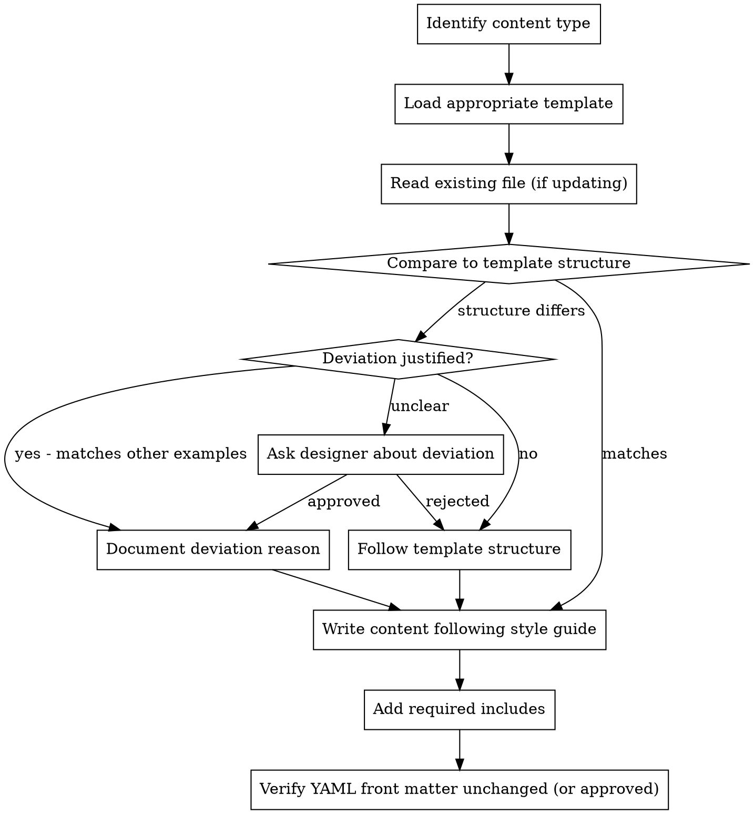

# Writing VADS Guidance

## Overview

Write VA Design System documentation that follows established templates and style standards while allowing appropriate deviation based on designer judgment or existing system patterns.

**Announce at start:** "I'm using the writing-vads-guidance skill to help write documentation that follows VADS standards."

**Called by:** doc-queue (Step 5: Execute Documentation Updates)

## When to Use

- Writing new component, pattern, or template documentation
- Updating existing VADS guidance
- Reached "Making Changes" point in doc-queue workflow
- Need to ensure documentation follows VADS standards

## The Process



## Content Types and Templates

### Components (`src/_components/`)

**Template location:** `src/_components/template.md`

**Required sections:**
1. Examples (Web and Mobile app with Storybook embeds)
2. Usage (When to use / When to consider something else / How this component works)
3. Behavior (Web / Mobile app / Placement / Design principles)
4. Code Usage (via include)
5. Content considerations
6. Accessibility considerations
7. Related
8. Component checklist (via include)

**Required front matter:**
```yaml
---
layout: component
title: Component Name
draft: true  # Remove when ready to publish
web: true
mobile-app: true  # If applicable
intro-text: "Purpose and function of the component"
figma-link-web: [URL]
status: use-with-caution-candidate  # See Status Values section for all options
web-component: va-component-name
---
```

### Patterns (`src/_patterns/`)

**Template location:** `src/_patterns/template.md`

**Required sections:**
1. Examples (in production / other relevant)
2. Usage (When to use / When not to use / When to use caution)
3. How to design and build (Anatomy / How it works / Components used / Page templates)
4. Code usage
5. Content considerations
6. Accessibility considerations

**Required front matter:**
```yaml
---
layout: pattern
title: Pattern Name
draft: true
permalink: /patterns/[ask|help]-users-to/[pattern-name]
sub-section: [ask-users-to|help-users-to]
intro-text: "Purpose and function of the pattern"
figma-link: [URL]
status: use-with-caution-candidate
---
```

### Templates (`src/_templates/`)

**Template location:** `src/_templates/template.md`

**Required sections:**
1. About
2. Usage (When to use / When not to use)
3. Structure
4. Variations
5. Content considerations
6. Accessibility considerations
7. Examples
8. Related

**Required front matter:**
```yaml
---
layout: pattern
title: Template Name
draft: true
status: use-with-caution-candidate
intro-text: "Purpose and function of the template"
figma-link: [URL]
---
```

## Required Jekyll Includes

### Storybook Preview

```liquid

```

**For mobile:**
```liquid

```

### Images

```liquid

```

**Image rules:**
- Upload to `/images/` folder
- No spaces in filenames
- Include alt text and caption

### Code Props (Components only)

```liquid

```

### Component Checklist (Components only)

```liquid

```

## Style Standards

### VADS-Specific Deviations from VA.gov Style Guide

| Standard | VADS Deviation |
|----------|----------------|
| Title case | Permitted for component/pattern/template names |
| Abbreviations | Define on first use (support new teams) |
| Technical depth | Higher expertise level acceptable |
| "User" terminology | Acceptable in design system context |

### Writing Guidelines

**DO:**
- Use title case for component names: "Alert Component", "Button Group"
- Hyperlink component references: `[Alert](/components/alert/)`
- Define abbreviations: "USWDS (U.S. Web Design System)"
- Include AKA sections for alternative names users might search
- Use plain language while allowing technical depth

**DON'T:**
- Modify YAML front matter without explicit approval
- Remove existing sections without asking
- Change component status without designer approval
- Add content that contradicts existing guidance elsewhere

## Handling Deviations

### When Deviation is Appropriate

1. **Matches another system example** - If similar components/patterns deviate consistently, follow that pattern
2. **Designer explicitly approves** - Document the reason
3. **Content doesn't fit template** - Some components need fewer/different sections

### When to Ask the Designer

**Template deviations:**
```
The template suggests [X section], but:
- This component doesn't have [relevant feature]
- Similar component [Y] omits this section
- Adding it would [reason]

Should we:
1. Follow template and add the section
2. Omit it (matching [similar example])
3. Something else
```

**Multiple valid approaches:**
- "Should we add this as a new section or expand the existing guidance?"

**Design decisions unclear:**
- "The issue mentions [X]. How should this be presented to users?"

**Scope questions:**
- "This change could also apply to [related component]. Should we update both?"

**Content tone:**
- "Should this be framed as a requirement ('must') or recommendation ('should')?"

### Documenting Deviations

When deviating from template, add HTML comment:
```html
<!-- Deviation from template: [section] omitted because [reason]. Approved by [designer] on [date]. -->
```

## YAML Front Matter Protection

**CRITICAL:** Never modify front matter without explicit approval.

Front matter controls:
- Page layout and rendering
- Navigation placement
- Search indexing
- Component status display

**Before any front matter change:**
1. Show current front matter
2. Show proposed change
3. Explain impact
4. Get explicit approval

## Quality Checklist

Before completing documentation:

- [ ] Follows appropriate template structure (or deviation approved)
- [ ] All required sections present
- [ ] Storybook embeds use correct syntax
- [ ] Images have alt text and captions
- [ ] Component references are hyperlinked
- [ ] Abbreviations defined on first use
- [ ] No orphaned includes (all referenced files exist)
- [ ] YAML front matter unchanged (or change approved)
- [ ] Draft status set appropriately

## Quick Reference

### File Paths

| Type | Path | Template |
|------|------|----------|
| Component | `src/_components/[name]/index.md` or `src/_components/[name].md` | `src/_components/template.md` |
| Pattern | `src/_patterns/[category]/[name].md` (categories: `ask-users-for`, `help-users-to`) | `src/_patterns/template.md` |
| Template | `src/_templates/[name].md` or `src/_templates/[category]/index.md` | `src/_templates/template.md` |

### Status Values

| Status | Meaning |
|--------|---------|
| `use-best-practice` | Recommended best practice across VA, widely adopted and stable |
| `use-deployed` | Production ready and deployed in at least one VA product |
| `use-with-caution-available` | Available but use carefully; has known limitations or pending updates |
| `use-with-caution-candidate` | Candidate pattern/component under development or evaluation |
| `dont-use-proposed` | Proposed pattern/component that should not be used yet |
| `dont-use-deprecated` | Deprecated; avoid new use and plan to migrate existing implementations |

### Common Includes

```liquid




```

## Common Mistakes

| Mistake | Fix |
|---------|-----|
| Modifying front matter without asking | Always show changes and get approval |
| Missing Storybook embeds for examples | Every example needs a preview |
| Hardcoding component names | Use `page.web-component` variable |
| Forgetting mobile examples | Check if component has mobile variant |
| Breaking existing links | Search for references before renaming |
| Removing sections silently | Ask before removing template sections |
