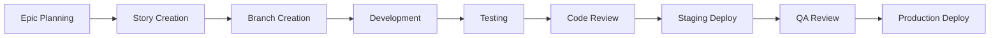

# Development Workflow

This document outlines our standard development workflow for all VA projects. This process ensures quality, consistency, and compliance across all teams.

## Overview

Our development process follows a GitHub-based workflow with the following key phases:



## 1. Epic & Story Planning

### Epic Creation
- **Purpose**: Large features or initiatives spanning multiple sprints
- **Owner**: Product Manager or Tech Lead
- **Requirements**: 
  - Clear acceptance criteria
  - Technical approach documented
  - Dependencies identified
  - Estimate provided

### Story Breakdown
- Stories should be completable within 1-2 sprints
- Each story must have:
  - Clear acceptance criteria
  - Design mockups (if applicable)
  - Technical requirements
  - Testing requirements

## 2. Development Process

### Branch Strategy
We use **GitFlow** with the following branch types:

- `main` - Production-ready code
- `develop` - Integration branch for features
- `feature/TICKET-123-description` - Feature development
- `hotfix/TICKET-456-description` - Production fixes
- `release/v1.2.3` - Release preparation

### Branch Naming Convention
```
feature/[TICKET-NUMBER]-[short-description]
hotfix/[TICKET-NUMBER]-[short-description]
release/v[MAJOR].[MINOR].[PATCH]
```

### Commit Message Format
We follow [Conventional Commits](https://www.conventionalcommits.org/):

```
type(scope): description

feat(auth): add OAuth integration
fix(button): resolve accessibility issue
docs(readme): update installation steps
```

## 3. Code Standards

### Required Checks
All pull requests must pass:

- **Linting**: ESLint and Stylelint
- **Type Checking**: TypeScript (if applicable)  
- **Unit Tests**: Minimum 80% coverage
- **Accessibility Tests**: axe-core compliance
- **Security Scan**: No high/critical vulnerabilities

### Code Review Requirements

#### Mandatory Reviews
- **2 approvals minimum** for production code
- **1 design system team approval** for component changes
- **1 accessibility specialist approval** for new UI components
- **1 security team approval** for authentication/authorization changes

#### Review Checklist
- [ ] Code follows style guide
- [ ] Tests provide adequate coverage
- [ ] Documentation updated
- [ ] Accessibility requirements met
- [ ] Performance impact considered
- [ ] Security implications reviewed

## 4. Testing Strategy

### Test Types Required

| Test Type | When Required | Coverage |
|-----------|---------------|----------|
| Unit Tests | All code | 80%+ |
| Integration Tests | API endpoints | Critical paths |
| E2E Tests | UI components | Happy path |
| Accessibility Tests | UI changes | WCAG 2.1 AA |
| Performance Tests | New features | Baseline + 10% |

### Testing Tools
- **Unit**: Jest, React Testing Library
- **Integration**: Cypress, Supertest
- **Accessibility**: axe-core, Pa11y
- **Performance**: Lighthouse CI, WebPageTest

## 5. Deployment Process

### Staging Deployment
- **Trigger**: PR merge to `develop`
- **Environment**: `staging.va.gov`
- **Testing**: QA team validation
- **Duration**: 2-5 business days

### Production Deployment
- **Schedule**: Tuesdays and Thursdays, 2-4 PM ET
- **Approval**: Product Owner + Tech Lead
- **Rollback Plan**: Automated via deployment pipeline
- **Monitoring**: 24-hour post-deployment monitoring

### Deployment Checklist
- [ ] Feature flag configured
- [ ] Database migrations tested
- [ ] Environment variables updated
- [ ] Monitoring alerts configured
- [ ] Rollback plan documented
- [ ] Team notifications sent

## 6. Emergency Hotfixes

### Criteria
Hotfixes are reserved for:
- **Security vulnerabilities** (immediate)
- **System outages** (P1 incidents)
- **Critical user-blocking issues** (P2 incidents)

### Process
1. **Create hotfix branch** from `main`
2. **Implement minimal fix** (no feature additions)
3. **Fast-track review** (1 approval minimum)
4. **Deploy immediately** to production
5. **Backport to develop** branch

## 7. Documentation Requirements

### Required Documentation
- **README updates** for new projects/features
- **API documentation** for endpoint changes
- **Deployment notes** for infrastructure changes
- **User guides** for new features

### Documentation Standards
- Use Markdown for all docs
- Include code examples
- Add diagrams for complex flows
- Keep screenshots current

## Tools & Resources

### Development Tools
- **IDE**: VS Code with recommended extensions
- **API Client**: Insomnia or Postman
- **Database**: pgAdmin or DataGrip
- **Version Control**: GitHub Desktop or command line

### Monitoring & Alerts
- **Application Monitoring**: Datadog
- **Error Tracking**: Sentry  
- **Uptime Monitoring**: Pingdom
- **Performance**: New Relic

### Useful Links
- [GitHub Repository](https://github.com/department-of-veterans-affairs/vets-website)
- [Design System](https://design.va.gov)
- [API Documentation](https://developer.va.gov/)
- [DevOps Runbook](./deployment.md)

---

## Questions?

- **Slack**: #platform-design-system
- **Office Hours**: Tuesdays 2-3 PM ET
- **Documentation Issues**: [Create GitHub Issue](https://github.com/department-of-veterans-affairs/vets-design-system-documentation/issues/new)